<style>
.two-columns {
  display: flex;
  justify-content: space-around;
  align-items: center;
  gap: 20px;
}
.two-columns img {
  max-width: 48%;
  height: auto;
}
section.top-align {
  display: flex;
  flex-direction: column;
  justify-content: flex-start;
  padding-top: 100px;
}
h2 {
    font-weight: bold !important;
  }
</style>


$$
% Custom Functions
\gdef\c#1{\mathcal{#1}}
\gdef\bf#1{\mathbf{#1}}
\gdef\bb#1{\mathbb{#1}}
$$

<!-- _paginate: false -->

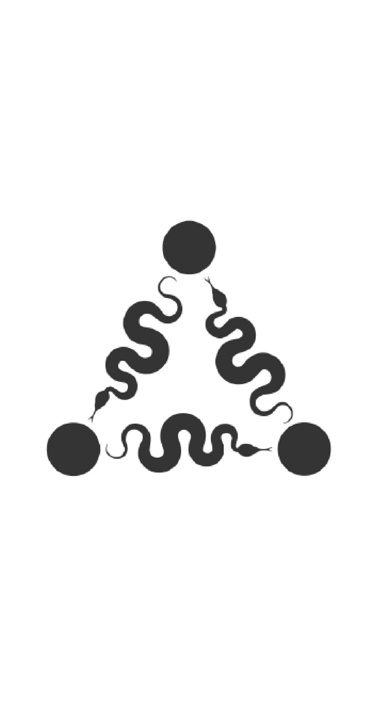


# *Tutorial on PyKEEN Ecosystem* From Training and Evaluation to Hyperparameter Optimization

### Machine Learning
### A.A. 2024-2025

<br/>

Teacher: 	**Claudia d'Amato**
Speaker:    **Ivan Diliso**


> Computer Science Department 
> University of Bari Aldo Moro


<!-- _footer: ""-->
---


# Who am I?
### **Ivan Diliso**

Ph.D in Computer Science and Mathematics from *ARA* (Autoamted Learning and Reasoning).

# What's my research?
Knowledge Graph Embedding, Neuro-Symbolic AI, Ontologies and Ontology Injection


---

# *Prerequisites*


### **Cloud Computing**:​
- **Google Colab​** You can access all the code materials from this link: [​](https://colab.research.google.com/drive/1svs7cWEHyo3GAgvajAtjzOtqCUw9R7G1?usp=share_link​)


### **Local Machine**:​
- Python 3.x​ & pip
- Jupyter Notebook​
- Visual Studio Code​
​

---


# *Contents*

1. Introduction to **PyKEEN​**
2. Installation 
3. PyKEEN Architecture​
4. Creating and Loading a **Dataset** ​[](https://pykeen.readthedocs.io/en/stable/reference/datasets.html)
5. **Training** a Model  ​[](https://pykeen.readthedocs.io/en/stable/reference/training.html)
6. **Evaluating** the Model ​[](https://pykeen.readthedocs.io/en/stable/reference/evaluation.html)
7. Using **Pipelines** and saving results ​[](https://pykeen.readthedocs.io/en/stable/api/pykeen.pipeline.PipelineResult.html#pykeen.pipeline.PipelineResult.save_model)​
8. **Visualize** learned embeddings ​[](https://pykeen.readthedocs.io/en/stable/tutorial/first_steps.html#loading-a-pre-trained-model)
9. **Hyperparameter** Optimization ​[](https://pykeen.readthedocs.io/en/stable/reference/hpo.html)

---

# Introduction to *PyKEEN*


###  **What is PyKEEN**?

- PyKEEN is a Python library for **training** and **evaluating** knowledge graph embeddings based on **PyTorch**.
- It supports various **models**, **datasets**, and evaluation **metrics**.
- Designed to be user-friendly and extensible.

### **Key Features**:
- Easy-to-use APIs for model training and evaluation.
- Support for a wide range of KG embedding models ​[](https://pykeen.readthedocs.io/en/stable/reference/models.html).
- Built-in support for popular datasets ​[](https://pykeen.readthedocs.io/en/stable/reference/datasets.html)
- Tools for hyperparameter optimization and result visualization ​[](https://pykeen.readthedocs.io/en/stable/api/pykeen.pipeline.PipelineResult.html)

---

# **Installation**

To get started, you need to install PyKEEN using following command on your **terminal**:

<br>

```bash
pip install pykeen
```

<br>

Make sure you have latest Python version installed on your system.

---

# PyKEEN **Architecture**

1. The **configuration layer** assists users to specify experiments

2. The **learning layer** trains a model with user-defined hyperparameters

3.  Finally, **embeddings**, **trained model**, and **configuration settings** are produced

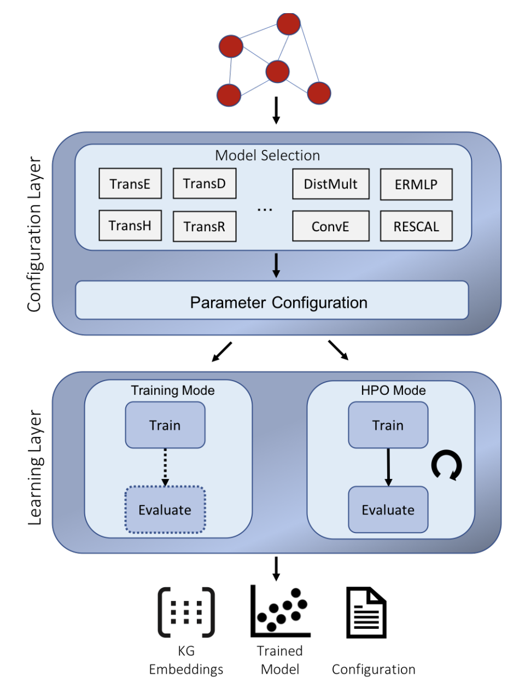


<!-- _footer: Image from (Ali et. al. 2019) -->

---

# PyKEEN **Architecture**

- **CLI**: Run experiments via command line interface
- **Pipeline**: Module starts and controls the configured experiments
- **HPO Pipeline**: Uses *OPTUNA* to optimize the experiments parameters
- **KGE Model**
- **Training**: Training the KGEModel
- **Evaluator**: Evaluate model with defined metrics
- **Inference**: Use the trained model for prediction
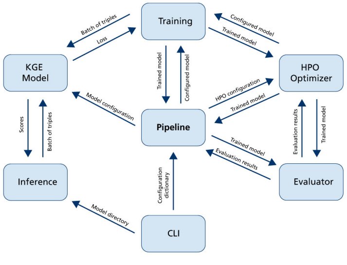

<!-- _footer: Image from (Ali et. al. 2019) -->

---

# Creating and Loading a **Dataset**

PyKEEN supports KGs represented as *RDF* and as *tab-separated values*


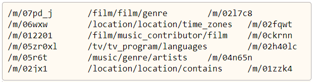
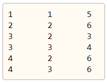
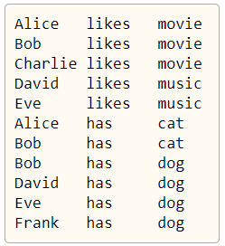

---

# Creating and Loading a **Dataset**

- PyKEEN supports a variety of datasets for KGE and evaluation tasks. well-known benchmark datasets like *FB15k*, *WN18*, *YAGO3-10*, and more.

- The Library provides tools to easily **load and preprocess these datasets**, facilitating the development and comparison

<div>
<center>
<a href="https://colab.research.google.com/drive/1svs7cWEHyo3GAgvajAtjzOtqCUw9R7G1?usp=share_link">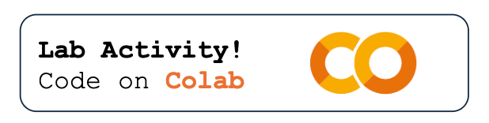</a>
</div>

---
# Creating and Loading a **Dataset**

You can also load a custom dataset directly from file. PyKeen stores data in **TriplesFactory** and automatically assigns an ids to you data in RDF format

```python
from pykeen.triples import TriplesFactory
file = Path("path_to_file.txt")
training = TriplesFactory.from_file(file)
```
<br>

In this case you need to provide your own **splitting** of data

```python
train, valid, test = triples.split(
	ratios = [0.8, 0.1, 0.1],
	random_state = 42
)
```

---

# **Training** a Model

The **configuration layer** enables users to specify every detail of an experiment for example: 

- Datasets
- Execution mode
- KGE model along with its hyper-parameter values
- Negative Sampler
- Details of the evaluation procedure

You can both **instantiate** your own classes or provide **kwargs** for them


---

# **Training** a Model

There are several possible configurations, PyKeen supports a large pool of Models, Dataset, TrainingLoop, Losses and Metrics

- *Losses*: **MarginRankingLoss** and **BinaryCrossEntropy** are the most used

- *TrainingLoop*: **sLCWA** is the most used for link prediction tasks

<div>
<center>
<a href="https://colab.research.google.com/drive/1svs7cWEHyo3GAgvajAtjzOtqCUw9R7G1?usp=share_link"></a>
</div>

---

# **Evaluation** and Metrics

- The widely applied metrics *mean-rank* and *hits@k* are computed for the evaluation procedure. 

- Users can specify whether they want to compute the mean-rank and hits@k in the *raw* or *filtered* setting.

- In the filtered setting, **artificially created negative samples** that are contained as positive examples in the training set will be removed

<div>
<center>
<a href="https://colab.research.google.com/drive/1svs7cWEHyo3GAgvajAtjzOtqCUw9R7G1?usp=share_link"></a>
</div>

---
# Using **Pipelines** and Saving **Artifacts**

The PyKEEN library provides a **high-level abstraction** called the *pipeline*

- Easily to set up and execute the KGE process.
- Essentially a **sequence of steps** that includes:
    - Data loading
    - Model instantiation
    - Training, and Evaluation
- Allows users to perform **end-to-end experiments** without needing to manually write code for each step.

---
# Using **Pipelines** and Saving **Artifacts**

After any execution, both from custom training and pipeline, any result can be **saved on disk**, this operation saves both:
- Results
- Model artifacts (weights)
- Running configuration in JSON format
- Metadata
- Training metrics

<div>
<center>
<a href="https://colab.research.google.com/drive/1svs7cWEHyo3GAgvajAtjzOtqCUw9R7G1?usp=share_link"></a>
</div>

---


# **Visualize** Learned Embeddings

<div class="two-columns">
  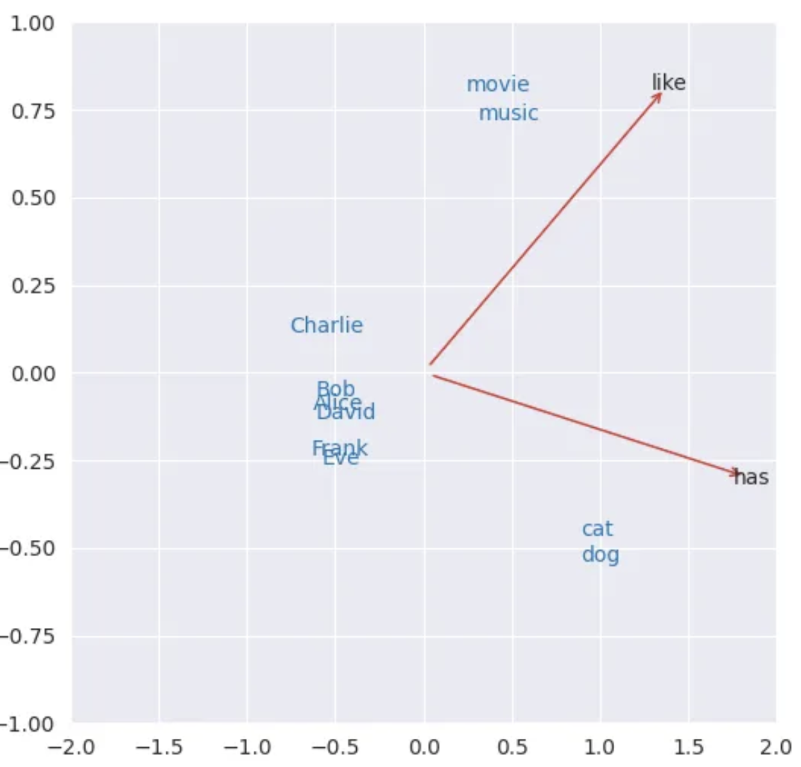
  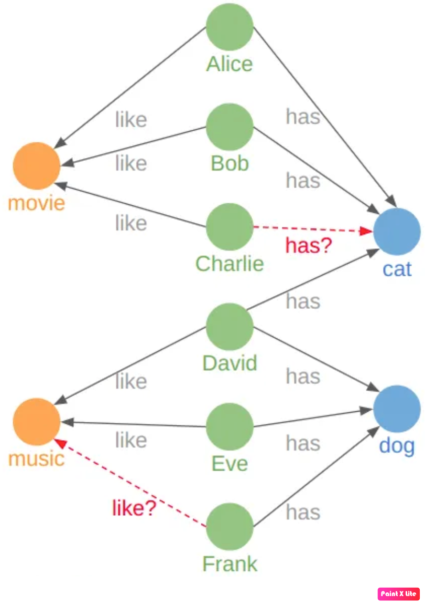
</div>

<!-- _footer: Image Source: https://wasit7.medium.com/tutorial-knowledge-graph-embedding-with-pykeen-22d3b7847cea 
-->

---

# **Visualize** Learned Embeddings

Lets use the learned embeddings to visualize our data!


<div>
<center>
<a href="https://colab.research.google.com/drive/1svs7cWEHyo3GAgvajAtjzOtqCUw9R7G1?usp=share_link"></a>
</div>

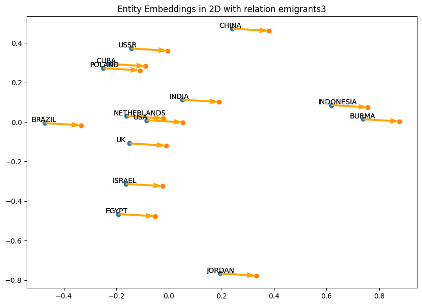


---

# **Hyperparameters** Optimization

- In training mode users provide for each hyper-parameter the corresponding value. 

- In *HPO mode*:
    - You define a set of values for each parameter
    - PyKEEN assists to find **suitable hyper-parameter** values by applying various **searching algorithms** such as random search
    - Uses the validation set to tune and find the optimal parameters

<div>
<center>
<a href="https://colab.research.google.com/drive/1svs7cWEHyo3GAgvajAtjzOtqCUw9R7G1?usp=share_link"></a>
</div>


---

# Overall **Architecture**


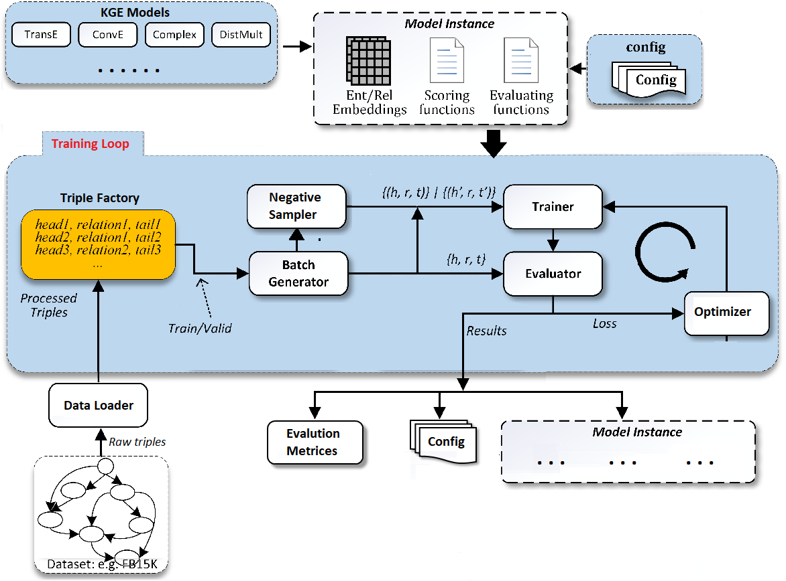

---


# *References*

## Tips
- Tune hyperparameters for better performance.
- Use visualization tools to understand embeddings.
- Implementing and integrating custom modules for *Research and Development*.

## Documentation: [](https://pykeen.readthedocs.io/)
## Source Code: [](https://github.com/pykeen/pykeen)

---

<!-- paginate: false-->
<!-- header: "" -->
<!-- footer: "" -->


# <center> *Thank you for your attention!*
<center> Ivan Diliso, Ph.D Student, ARA


